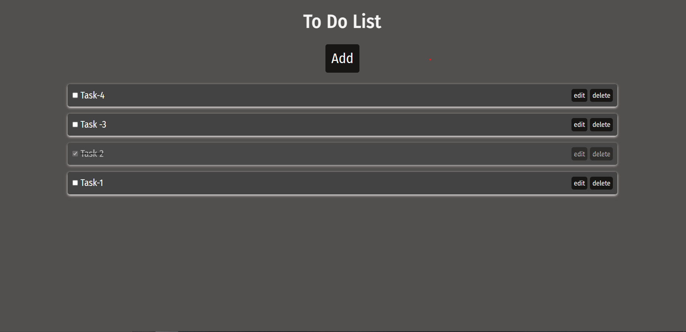

<h1 align="center" >To-Do-List</h1>

<!-- ABOUT THE PROJECT -->
## About The Project

This is simple to-do-list with edit, delete and mark as done features. The data will be saved in local storage as array of object having id as time of creation, text as the acutal data and complete stores the status of task.
 
The Project can be accessed from the link: https://sunny06a.github.io/to-do-list/

### Built With
<ul>
  <li>HTML</li>
  <li>CSS</li>
  <li>JavaScript</li>
</ul>
